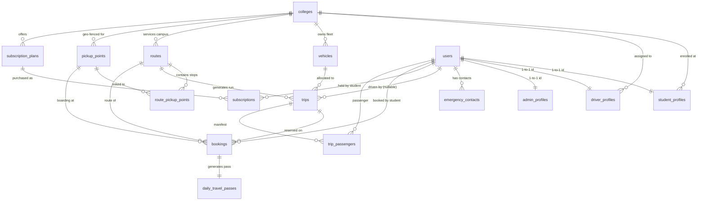

# DATABASE RELATIONSHIPS & SCHEMA ARCHITECTURE

This document is the authoritative, system-wide architectural reference for all database entities, foreign keys, cascade rules, relational joins, and data synchronization patterns across the College Shared Cab/Shuttle platform.

**Single Source of Truth:** Supabase PostgreSQL Database.
All applications (Student Flutter App, Driver Flutter App, React Admin Panel) consume live relational data via the Node.js Express Backend.

---

## 1. Table Classification

The 27 database tables are organized into 6 functional tiers:

```
┌────────────────────────────────────────────────────────────────────────┐
│                        TIER 1: MASTER ENTITIES                         │
│   colleges  •  users  •  vehicles  •  routes  •  pickup_points        │
│   subscription_plans                                                   │
└───────────────────────────────────┬────────────────────────────────────┘
                                    │
┌───────────────────────────────────▼────────────────────────────────────┐
│              TIER 2: PROFILES & STRUCTURAL ASSOCIATIONS                │
│   student_profiles  •  driver_profiles  •  admin_profiles              │
│   emergency_contacts  •  route_pickup_points                           │
└───────────────────────────────────┬────────────────────────────────────┘
                                    │
┌───────────────────────────────────▼────────────────────────────────────┐
│                    TIER 3: OPERATIONAL COMMUTE ENTITIES                │
│   trips  •  bookings  •  daily_travel_passes  •  trip_passengers       │
│   delay_reports                                                        │
└───────────────────────────────────┬────────────────────────────────────┘
                                    │
┌───────────────────────────────────▼────────────────────────────────────┐
│             TIER 4: FINANCIAL, AUDIT & HISTORICAL LEDGERS              │
│   payments  •  refunds  •  qr_authentication_logs  •  ratings          │
│   complaints  •  ride_history  •  audit_logs                           │
└───────────────────────────────────┬────────────────────────────────────┘
                                    │
┌───────────────────────────────────▼────────────────────────────────────┐
│                 TIER 5: REAL-TIME GPS & TELEMETRY                      │
│   vehicle_current_locations • vehicle_locations • vehicle_location_hist│
└───────────────────────────────────┬────────────────────────────────────┘
                                    │
┌───────────────────────────────────▼────────────────────────────────────┐
│             TIER 6: SYSTEM CONFIGURATION & CALENDAR                    │
│   system_settings  •  college_holidays  •  notifications               │
└────────────────────────────────────────────────────────────────────────┘
```

---

## 2. Complete Entity Relationship Matrix (All 27 Tables)

| # | Table Name | Primary Key | Description | Classification |
|---|------------|-------------|-------------|----------------|
| 1 | `colleges` | `id` (UUID) | Campus master record, coordinates, service radius | Master Entity |
| 2 | `users` | `id` (UUID) | System auth entity (Student, Driver, Admin) | Master Entity |
| 3 | `student_profiles` | `id` (UUID) | Student academic ID, course, semester, verification | Dependent Profile |
| 4 | `driver_profiles` | `id` (UUID) | Driver license, Aadhar, experience, verification | Dependent Profile |
| 5 | `admin_profiles` | `id` (UUID) | Admin department and permission scopes | Dependent Profile |
| 6 | `emergency_contacts` | `id` (UUID) | SOS emergency contact directory per user | Dependent Profile |
| 7 | `vehicles` | `id` (UUID) | Fleet cab/shuttle vehicles and seating capacities | Master Entity |
| 8 | `routes` | `id` (UUID) | Fixed transit corridors with morning/evening times | Master Entity |
| 9 | `pickup_points` | `id` (UUID) | Geo-tagged boarding points and distance markers | Master Entity |
| 10 | `route_pickup_points` | `id` (UUID) | Ordered sequence of stops along a route | Association |
| 11 | `subscription_plans` | `id` (UUID) | Monthly/term pass pricing tiers and allowances | Master Entity |
| 12 | `subscriptions` | `id` (UUID) | Active and expired student pass subscriptions | Operational |
| 13 | `trips` | `id` (UUID) | Daily scheduled/in-progress/completed runs | Operational |
| 14 | `bookings` | `id` (UUID) | Student confirmed seat reservations | Operational |
| 15 | `daily_travel_passes` | `id` (UUID) | Dynamic QR tokens & validation lifecycle | Operational |
| 16 | `trip_passengers` | `id` (UUID) | Driver boarding manifest and seat tracking | Operational |
| 17 | `delay_reports` | `id` (UUID) | Traffic delay notices broadcast to passengers | Operational |
| 18 | `payments` | `id` (UUID) | Razorpay/UPI subscription payment records | Financial Ledger |
| 19 | `refunds` | `id` (UUID) | Subscription cancellation refund audits | Financial Ledger |
| 20 | `qr_authentication_logs`| `id` (UUID) | Tamper-proof scan attempt history | Security Audit |
| 21 | `ratings` | `id` (UUID) | Student feedback and star ratings per trip | Feedback Ledger |
| 22 | `complaints` | `id` (UUID) | Support tickets and admin resolution notes | Support Ledger |
| 23 | `ride_history` | `id` (UUID) | Immutable historical commute archive | Historical Ledger |
| 24 | `audit_logs` | `id` (UUID) | System action and security trail | Security Audit |
| 25 | `vehicle_current_locations`| `id` (UUID)| High-frequency live GPS coordinate pointer | Real-time Telemetry |
| 26 | `vehicle_locations` | `id` (UUID) | Driver live broadcast location cache | Real-time Telemetry |
| 27 | `vehicle_location_history` | `id` (UUID) | Telemetry breadcrumbs for route playback | Real-time Telemetry |
| 28 | `college_holidays` | `id` (UUID) | Non-service academic holidays | Calendar Config |
| 29 | `notifications` | `id` (UUID) | Push and in-app message inbox | System Messages |
| 30 | `system_settings` | `id` (UUID) | Global feature flags and application thresholds| System Config |

---

## 3. Comprehensive Foreign Key & Cascade Mapping

The database enforces 69 referential integrity constraints. The cascade rules ensure data consistency while strictly preventing unintended loss of financial or compliance history.



### Detailed Constraint Inventory:

#### A. Master & Profile Associations
1. `student_profiles.id` $\rightarrow$ `users.id` [ON DELETE CASCADE, ON UPDATE CASCADE]
2. `student_profiles.college_id` $\rightarrow$ `colleges.id` [ON DELETE RESTRICT, ON UPDATE CASCADE]
3. `student_profiles.verified_by` $\rightarrow$ `users.id` [ON DELETE SET NULL, ON UPDATE CASCADE]
4. `driver_profiles.id` $\rightarrow$ `users.id` [ON DELETE CASCADE, ON UPDATE CASCADE]
5. `driver_profiles.college_id` $\rightarrow$ `colleges.id` [ON DELETE RESTRICT, ON UPDATE CASCADE]
6. `admin_profiles.id` $\rightarrow$ `users.id` [ON DELETE CASCADE, ON UPDATE CASCADE]
7. `emergency_contacts.user_id` $\rightarrow$ `users.id` [ON DELETE CASCADE, ON UPDATE CASCADE]
8. `vehicles.college_id` $\rightarrow$ `colleges.id` [ON DELETE RESTRICT, ON UPDATE CASCADE]
9. `routes.college_id` $\rightarrow$ `colleges.id` [ON DELETE RESTRICT, ON UPDATE CASCADE]
10. `routes.default_vehicle_id` $\rightarrow$ `vehicles.id` [ON DELETE SET NULL, ON UPDATE CASCADE]
11. `routes.default_driver_id` $\rightarrow$ `users.id` [ON DELETE SET NULL, ON UPDATE CASCADE]
12. `pickup_points.college_id` $\rightarrow$ `colleges.id` [ON DELETE RESTRICT, ON UPDATE CASCADE]
13. `route_pickup_points.route_id` $\rightarrow$ `routes.id` [ON DELETE CASCADE, ON UPDATE CASCADE]
14. `route_pickup_points.pickup_point_id` $\rightarrow$ `pickup_points.id` [ON DELETE RESTRICT, ON UPDATE CASCADE]
15. `subscription_plans.college_id` $\rightarrow$ `colleges.id` [ON DELETE RESTRICT, ON UPDATE CASCADE]

#### B. Commute Operations & Reservations
16. `subscriptions.student_id` $\rightarrow$ `users.id` [ON DELETE CASCADE, ON UPDATE CASCADE]
17. `subscriptions.plan_id` $\rightarrow$ `subscription_plans.id` [ON DELETE RESTRICT, ON UPDATE CASCADE]
18. `trips.route_id` $\rightarrow$ `routes.id` [ON DELETE RESTRICT, ON UPDATE CASCADE]
19. `trips.vehicle_id` $\rightarrow$ `vehicles.id` [ON DELETE RESTRICT, ON UPDATE CASCADE]
20. `trips.driver_id` $\rightarrow$ `users.id` [ON DELETE SET NULL, ON UPDATE CASCADE] *(Nullable for unassigned trips)*
21. `bookings.student_id` $\rightarrow$ `users.id` [ON DELETE CASCADE, ON UPDATE CASCADE]
22. `bookings.subscription_id` $\rightarrow$ `subscriptions.id` [ON DELETE CASCADE, ON UPDATE CASCADE]
23. `bookings.trip_id` $\rightarrow$ `trips.id` [ON DELETE CASCADE, ON UPDATE CASCADE]
24. `bookings.route_id` $\rightarrow$ `routes.id` [ON DELETE RESTRICT, ON UPDATE CASCADE]
25. `bookings.pickup_point_id` $\rightarrow$ `pickup_points.id` [ON DELETE RESTRICT, ON UPDATE CASCADE]
26. `daily_travel_passes.student_id` $\rightarrow$ `users.id` [ON DELETE CASCADE, ON UPDATE CASCADE]
27. `daily_travel_passes.booking_id` $\rightarrow$ `bookings.id` [ON DELETE CASCADE, ON UPDATE CASCADE]
28. `daily_travel_passes.trip_id` $\rightarrow$ `trips.id` [ON DELETE CASCADE, ON UPDATE CASCADE]
29. `daily_travel_passes.route_id` $\rightarrow$ `routes.id` [ON DELETE RESTRICT, ON UPDATE CASCADE]
30. `daily_travel_passes.pickup_point_id` $\rightarrow$ `pickup_points.id` [ON DELETE RESTRICT, ON UPDATE CASCADE]
31. `trip_passengers.trip_id` $\rightarrow$ `trips.id` [ON DELETE CASCADE, ON UPDATE CASCADE]
32. `trip_passengers.booking_id` $\rightarrow$ `bookings.id` [ON DELETE CASCADE, ON UPDATE CASCADE]
33. `trip_passengers.student_id` $\rightarrow$ `users.id` [ON DELETE CASCADE, ON UPDATE CASCADE]
34. `trip_passengers.pickup_point_id` $\rightarrow$ `pickup_points.id` [ON DELETE RESTRICT, ON UPDATE CASCADE]
35. `trip_passengers.verified_by_driver_id` $\rightarrow$ `users.id` [ON DELETE SET NULL, ON UPDATE CASCADE]
36. `delay_reports.trip_id` $\rightarrow$ `trips.id` [ON DELETE CASCADE, ON UPDATE CASCADE]
37. `delay_reports.driver_id` $\rightarrow$ `users.id` [ON DELETE SET NULL, ON UPDATE CASCADE]
38. `delay_reports.current_stop_id` $\rightarrow$ `pickup_points.id` [ON DELETE SET NULL, ON UPDATE CASCADE]

#### C. Financial Ledgers & Security Audits
39. `payments.student_id` $\rightarrow$ `users.id` [ON DELETE SET NULL, ON UPDATE CASCADE] *(Preserve financial transaction)*
40. `payments.subscription_id` $\rightarrow$ `subscriptions.id` [ON DELETE SET NULL, ON UPDATE CASCADE]
41. `refunds.payment_id` $\rightarrow$ `payments.id` [ON DELETE RESTRICT, ON UPDATE CASCADE]
42. `refunds.booking_id` $\rightarrow$ `bookings.id` [ON DELETE SET NULL, ON UPDATE CASCADE]
43. `refunds.student_id` $\rightarrow$ `users.id` [ON DELETE SET NULL, ON UPDATE CASCADE]
44. `qr_authentication_logs.pass_id` $\rightarrow$ `daily_travel_passes.id` [ON DELETE SET NULL, ON UPDATE CASCADE]
45. `qr_authentication_logs.trip_id` $\rightarrow$ `trips.id` [ON DELETE SET NULL, ON UPDATE CASCADE]
46. `qr_authentication_logs.student_id` $\rightarrow$ `users.id` [ON DELETE SET NULL, ON UPDATE CASCADE]
47. `qr_authentication_logs.driver_id` $\rightarrow$ `users.id` [ON DELETE SET NULL, ON UPDATE CASCADE]
48. `ratings.trip_id` $\rightarrow$ `trips.id` [ON DELETE CASCADE, ON UPDATE CASCADE]
49. `ratings.student_id` $\rightarrow$ `users.id` [ON DELETE SET NULL, ON UPDATE CASCADE]
50. `ratings.driver_id` $\rightarrow$ `users.id` [ON DELETE SET NULL, ON UPDATE CASCADE]
51. `complaints.student_id` $\rightarrow$ `users.id` [ON DELETE SET NULL, ON UPDATE CASCADE]
52. `complaints.resolved_by` $\rightarrow$ `users.id` [ON DELETE SET NULL, ON UPDATE CASCADE]
53. `ride_history.student_id` $\rightarrow$ `users.id` [ON DELETE SET NULL, ON UPDATE CASCADE]
54. `ride_history.trip_id` $\rightarrow$ `trips.id` [ON DELETE SET NULL, ON UPDATE CASCADE]
55. `ride_history.booking_id` $\rightarrow$ `bookings.id` [ON DELETE SET NULL, ON UPDATE CASCADE]
56. `ride_history.rating_id` $\rightarrow$ `ratings.id` [ON DELETE SET NULL, ON UPDATE CASCADE]
57. `audit_logs.user_id` $\rightarrow$ `users.id` [ON DELETE SET NULL, ON UPDATE CASCADE]

#### D. Real-Time Telemetry & Configuration
58. `vehicle_current_locations.vehicle_id` $\rightarrow$ `vehicles.id` [ON DELETE CASCADE, ON UPDATE CASCADE]
59. `vehicle_current_locations.trip_id` $\rightarrow$ `trips.id` [ON DELETE CASCADE, ON UPDATE CASCADE]
60. `vehicle_current_locations.driver_id` $\rightarrow$ `users.id` [ON DELETE CASCADE, ON UPDATE CASCADE]
61. `vehicle_locations.vehicle_id` $\rightarrow$ `vehicles.id` [ON DELETE CASCADE, ON UPDATE CASCADE]
62. `vehicle_locations.trip_id` $\rightarrow$ `trips.id` [ON DELETE CASCADE, ON UPDATE CASCADE]
63. `vehicle_locations.driver_id` $\rightarrow$ `users.id` [ON DELETE CASCADE, ON UPDATE CASCADE]
64. `vehicle_location_history.vehicle_id` $\rightarrow$ `vehicles.id` [ON DELETE CASCADE, ON UPDATE CASCADE]
65. `vehicle_location_history.trip_id` $\rightarrow$ `trips.id` [ON DELETE CASCADE, ON UPDATE CASCADE]
66. `vehicle_location_history.driver_id` $\rightarrow$ `users.id` [ON DELETE CASCADE, ON UPDATE CASCADE]
67. `college_holidays.college_id` $\rightarrow$ `colleges.id` [ON DELETE CASCADE, ON UPDATE CASCADE]
68. `notifications.user_id` $\rightarrow$ `users.id` [ON DELETE CASCADE, ON UPDATE CASCADE]

---

## 4. Single Source of Truth & Zero Denormalization Policy

### The Anti-Pattern: Denormalized Name Copying
Previously, when an entity (such as a College or Driver) was created, its textual name was duplicated into downstream records:
* ❌ `routes.college_name = "ABC College"`
* ❌ `trips.driver_name = "John Doe"`
* ❌ `bookings.pickup_name = "Main Gate"`

When the master record was updated, stale copied strings persisted across multiple tables and screens.

### The Standard: Pure Relational Resolution
Under this architecture:
1. Dependent tables **only store foreign key UUIDs** (`college_id`, `driver_id`, `vehicle_id`, `route_id`, `pickup_point_id`).
2. The Node.js repository layer dynamically resolves the current master record at query time using explicit PostgREST disambiguation syntax:

```typescript
// Example: Trip details query dynamically resolving entire tree
supabase.from('trips').select(`
  *,
  route:routes(
    *,
    college:colleges(*),
    route_pickup_points(
      *,
      pickup_point:pickup_points(*)
    )
  ),
  vehicle:vehicles(
    *,
    college:colleges(*)
  ),
  driver:users!trips_driver_id_fkey(
    *,
    profile:driver_profiles(*)
  )
`)
```

3. If `colleges.name` is updated from `"ABC College"` to `"XYZ Institute"`, **all routes, vehicles, students, drivers, trips, and bookings automatically return `"XYZ Institute"` on their next fetch**.

---

## 5. Master Entity Lifecycle & Update Propagation Rules

| Entity | Update Trigger | Dependent Views Updated Dynamically |
|---|---|---|
| **College** | Name, address, radius, geofence coordinates | Student App (Profile, Pass, Bookings), Driver App (Trips, Route Header), Admin (Colleges, Students, Drivers, Vehicles, Routes, Plans) |
| **Driver** | Name, phone, license, status | Driver App Dashboard, Admin Driver Table, Trip Details, Live Vehicle Manifest, Passenger Verification Logs |
| **Vehicle** | Registration, model, seating capacity, status | Admin Fleet View, Driver Active Vehicle Header, Trip Card Seating Meters, Student Live Track Details |
| **Route** | Route name, departure times, sequence order | Admin Routes Table, Driver Today Schedule, Student Route Selector, Live Stops List |
| **Stop (Pickup Point)**| Name, landmark, address, coordinates | Route Stop Sequences, Student Booking Pickup Dropdown, Driver Manifest Stop Filter, Pass Boarding Details |
| **Student** | Name, phone, course, semester, verification | Admin Students List, Subscription Records, Booking Seats, Trip Passenger Manifest, Pass Card Header |
| **Plan** | Name, price, validity, ride count, cancellation | Student Plan Selection Modal, Subscriptions List, Payment Receipts, Admin Plan Manager |
| **Driver Assignment** | Reassign Driver A $\rightarrow$ Driver B on a trip | Driver A dashboard immediately unassigns; Driver B dashboard immediately receives trip in Today's Schedule |

---

## 6. Safe Deletion & Historical Ledger Preservation

When records are deleted in the Admin panel:

1. **User Account Deletion**:
   - `student_profiles` or `driver_profiles` are deleted via `ON DELETE CASCADE`.
   - Any financial records (`payments`, `refunds`), `complaints`, and `ratings` have their `student_id` or `driver_id` updated to `NULL` via `ON DELETE SET NULL` to preserve financial auditability.
2. **Driver Unassignment & Removal**:
   - Before deleting a driver user, backend automatically unassigns the driver from active routes (`routes.default_driver_id = null`) and active trips (`trips.driver_id = null`).
   - Active GPS tracking rows in `vehicle_current_locations` are removed.
3. **Route & Vehicle Deletion Protection**:
   - Routes and Vehicles with active confirmed bookings or scheduled in-progress trips are protected by `RESTRICT` checks.
   - Deletion returns HTTP `409 Conflict` with a human-readable guidance message instructing the admin to reassign trips or deactivate the entity instead.
4. **Pickup Point / Stop Deletion & Route Auto-Unassign**:
   - When a pickup point is deleted, it is automatically unassigned and removed from all route stop schedules (`route_pickup_points` cascades).
   - Any historical delay reports, trip passenger manifests, daily travel passes, and bookings have their `pickup_point_id` set to `NULL` via `ON DELETE SET NULL` to preserve past commute history without blocking stop management.

---

## 7. Atomic Concurrency Procedures

Multi-table state transitions are executed via transactional PostgreSQL stored procedures to eliminate race conditions:

### `fn_book_trip_atomic`
Performs atomic lock, capacity verification, duplicate check, credit decrement, booking record insertion, pass generation, and passenger manifest linking in a single database transaction:
1. `SELECT * FROM trips WHERE id = p_trip_id FOR UPDATE`
2. Validate `booked_seats < max_capacity`
3. Validate student has no duplicate active booking for this date/trip
4. Decrement `subscriptions.remaining_rides`
5. Insert `bookings` record
6. Insert `daily_travel_passes` with dynamic HMAC token
7. Insert `trip_passengers` manifest entry
8. Increment `trips.booked_seats`

---

## 8. Frontend & Backend Model Conventions

To ensure zero drift across the stack, all JSON representations adhere to standard snake_case keys in Supabase/API layers and camelCase in Flutter/Dart domain models:

* Backend TypeScript Types: [`backend/src/types/index.ts`](file:///e:/Programs/Flutter%20Projects/college_shared_cab/backend/src/types/index.ts)
* Admin Web React Types: [`admin-web/src/types/index.ts`](file:///e:/Programs/Flutter%20Projects/college_shared_cab/admin-web/src/types/index.ts)
* Flutter Domain Models: [`lib/core/models/`](file:///e:/Programs/Flutter%20Projects/college_shared_cab/lib/core/models/)
