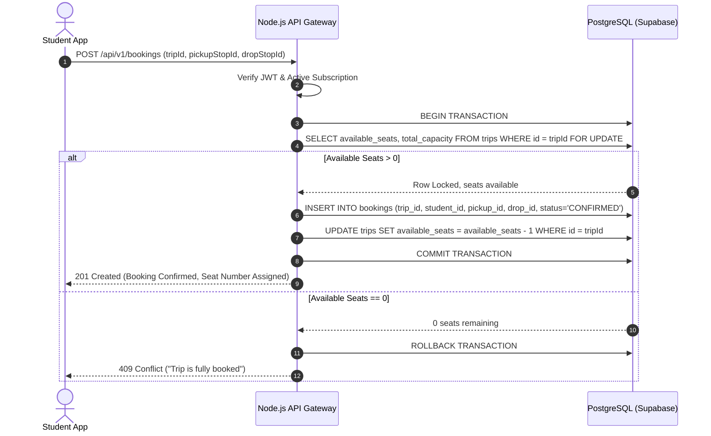
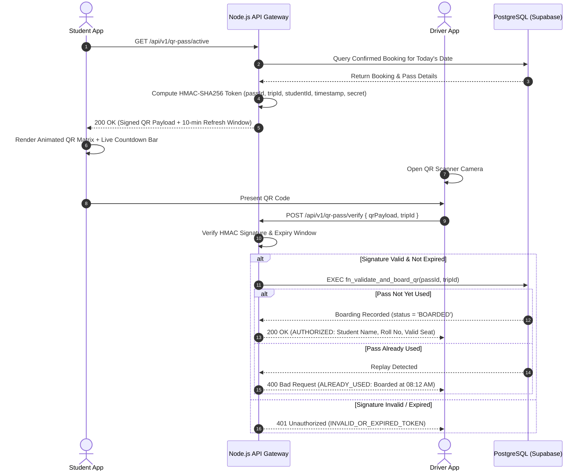

# College Shared Cab & Shuttle Platform — Architecture & System Design

## 1. System Overview

The **College Shared Cab & Shuttle Platform** is an enterprise-grade, full-stack multi-tenant transportation system engineered specifically for university and college campuses. It orchestrates fixed-route shuttle fleets, student subscriptions, dynamic route optimization with 10km geofencing, dynamic HMAC-SHA256 anti-replay QR travel passes, and real-time fleet GPS tracking.

```
                                  +-----------------------------+
                                  |     React.js Admin Web      |
                                  |    (Tailwind + Lucide UI)   |
                                  +--------------+--------------+
                                                 | (HTTPS / REST)
+------------------------+        +--------------v--------------+        +------------------------+
|  Flutter Student App   |        |   Node.js + TypeScript      |        |   Flutter Driver App   |
| (Riverpod + Material 3)|------->|      REST API Gateway       |<-------| (Riverpod + Material 3)|
+------------------------+  (REST)| (Express, Zod, JWT, RBAC)   | (REST) +------------------------+
                                  +--------------+--------------+
                                                 | (TCP / SQL)
                                  +--------------v--------------+
                                  |  Supabase PostgreSQL DB     |
                                  |  (28+ Tables, RLS, Procs)   |
                                  +-----------------------------+
```

---

## 2. Core Platform Components

### 2.1 Backend API Server (`backend/`)
- **Runtime**: Node.js v20+ with TypeScript.
- **Framework**: Express.js with modular router architecture (`/api/v1/auth`, `/api/v1/students`, `/api/v1/drivers`, `/api/v1/admin`, `/api/v1/bookings`, `/api/v1/qr-pass`, `/api/v1/payments`, `/api/v1/tracking`, `/api/v1/complaints`, `/api/v1/reports`, `/api/v1/holidays`).
- **Validation**: Strict schema validation using Zod on request headers, query parameters, and JSON payloads.
- **Authentication & Authorization**: Asymmetric/HMAC JSON Web Tokens with Role-Based Access Control (`STUDENT`, `DRIVER`, `ADMIN`, `SUPER_ADMIN`).
- **Concurrency Engine**: Row-level locking (`SELECT ... FOR UPDATE`) in `fn_book_trip_atomic` prevents race conditions and overbooking beyond vehicle seating capacities during simultaneous rush-hour booking surges.
- **Dynamic Security Engine**: HMAC-SHA256 cryptographic pass hashing containing timestamp, student ID, trip ID, and route ID with 10-minute anti-replay expiration windows.
- **Geofence Engine**: Haversine formula calculation enforcing strict 10km pickup radius thresholds against registered college campuses.

### 2.2 React.js Admin Web Dashboard (`admin-web/`)
- **Framework**: React 18 + Vite + TypeScript.
- **Styling**: Tailwind CSS with custom theme tokens and responsive flex/grid layouts.
- **Iconography**: Lucide React.
- **Data Visualization**: Recharts (Interactive area charts, bar charts, line graphs, and donut distributions).
- **Core Modules**:
  1. **Live KPI Dashboard**: 8 key operational statistics (Total Students, Subscriptions, Active Trips, Fleet Vehicles, On-Duty Drivers, Monthly Revenue, Fleet Occupancy).
  2. **Student & KYC Management**: Verification modal with one-click approval/rejection of student college IDs.
  3. **Pickup Points & Geofencing**: Real-time validation of pickup coordinates against 10km college radius.
  4. **Route & Stop Sequencer**: Ordered route stop builder with distance markers and morning/evening departure schedules.
  5. **Fleet & Driver Operations**: Vehicle registration, maintenance schedules, driver license management, and live GPS fleet radar.
  6. **Plans & Subscriptions**: Configurable pricing tiers (Monthly, Quarterly, Semester).
  7. **Financials & Bookings**: Concurrency audit logs, transaction histories, Razorpay/Stripe webhooks.
  8. **Grievance Resolution & SOS**: Real-time student safety alerts, complaint tracking, priority assignment.

### 2.3 Flutter Mobile Applications (`lib/`)
- **Framework**: Flutter 3.x (Dart 3.x) with Material Design 3.
- **State Management**: Flutter Riverpod (StateNotifierProvider, FutureProvider, StateProvider).
- **Navigation**: Declarative GoRouter with role-aware route guards and redirect logic.
- **Networking**: Dio with authentication interceptors, token refresh, and standardized error serialization.
- **Modes**:
  - **Student Application**:
    - College onboarding & KYC document submission.
    - Subscription plan selection & instant mock/live checkout.
    - Daily slot reservation with seat locking.
    - Live-updating dynamic HMAC-SHA256 QR Travel Pass.
    - Real-time GPS bus tracking with simulated waypoint breadcrumbs and dynamic ETA.
    - 24/7 Support ticket system with instant SOS broadcast.
  - **Driver Application**:
    - Shift management (Go On Duty / Go Off Duty).
    - Trip execution (Start Trip -> Progress through stops -> Complete Trip).
    - Passenger Manifest with boarding checklists.
    - High-speed QR scanner with instant visual/haptic validation feedback (`AUTHORIZED` vs `NOT AUTHORIZED / ALREADY USED`).

### 2.4 Supabase PostgreSQL Database (`supabase/`)
- **Schema**: 28+ relational tables enforcing foreign keys, UUID primary keys, composite unique constraints, and check constraints.
- **Security**: PostgreSQL Row-Level Security (RLS) policies isolating student records, driver assignments, and admin auditing.
- **Stored Procedures**:
  - `fn_book_trip_atomic`: Atomic seat reservation and capacity decrementing with isolation levels preventing overbooking.
  - `fn_validate_and_board_qr`: Atomic boarding status update, anti-replay verification, and trip manifest synchronization.
  - `fn_recalculate_driver_rating`: Incremental driver score aggregation based on completed trip feedback.

---

## 3. Data Flow Diagrams

### 3.1 Concurrency-Safe Booking Flow



### 3.2 Dynamic QR Pass Generation & Verification Flow



---

## 4. Scalability & Performance Strategy

1. **Database Indexing**: Compound indexes on `trips(trip_date, status, route_id)`, `bookings(trip_id, student_id, status)`, and `qr_passes(token_hash, status)`.
2. **Caching**: Redis-compatible in-memory caching for static route stop points, colleges, and subscription plan pricing tiers.
3. **Pessimistic Row Locking**: Eliminates double-booking bugs during high-concurrency peak booking windows (e.g. 7:00 AM daily reservation opening).
4. **Offline First Mobile UX**: SharedPreferences client-side caching in Flutter retains offline active passes and driver manifest rosters during network drops.
