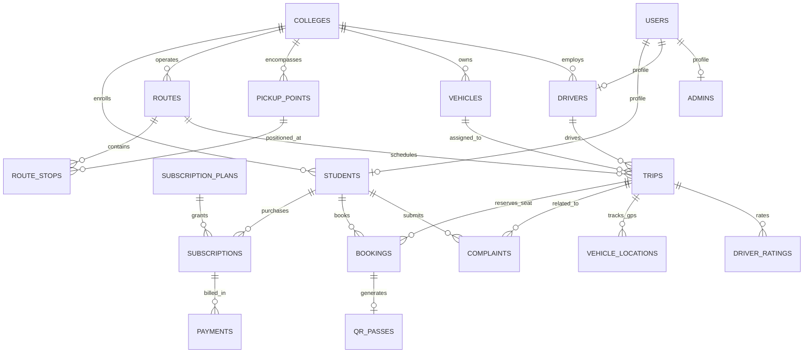

# College Shared Cab & Shuttle Platform — Database Entity-Relationship & Schema Reference

## 1. Schema Architecture Overview

The database is built on **Supabase PostgreSQL 15+** utilizing UUID primary keys, ISO 8601 timestamps, Row-Level Security (RLS) policies, JSONB audit structures, and transactional concurrency procedures with pessimistic row-locking (`SELECT FOR UPDATE`).

---

## 2. Core Entity Relationship Diagram (ERD)



---

## 3. Comprehensive Table Catalog

### 3.1 Authentication & Core Users

| Table Name | Primary Key | Key Foreign Keys | Purpose |
| :--- | :--- | :--- | :--- |
| `users` | `id (UUID)` | — | Central credentials, email, password hash, role (`STUDENT`, `DRIVER`, `ADMIN`, `SUPER_ADMIN`), active state |
| `colleges` | `id (UUID)` | — | Campus definitions, geo-coordinates (`lat`, `lng`), contact email, 10km geofence center point |
| `students` | `id (UUID)` | `user_id -> users`, `college_id -> colleges` | Student academic profile, enrollment roll number, department, semester, KYC doc URL, KYC approval state |
| `drivers` | `id (UUID)` | `user_id -> users`, `college_id -> colleges` | Driver profile, commercial license number, Aadhaar number, verification status, operational status (`AVAILABLE`, `ON_TRIP`, `OFF_DUTY`), aggregate rating |
| `admins` | `id (UUID)` | `user_id -> users`, `college_id -> colleges` | Campus fleet manager & support administrator credentials and authorization permissions |

### 3.2 Routes, Stops & Geofencing

| Table Name | Primary Key | Key Foreign Keys | Purpose |
| :--- | :--- | :--- | :--- |
| `pickup_points` | `id (UUID)` | `college_id -> colleges` | Geographical boarding locations with latitude, longitude, landmark description, distance to college in KM, and 10km approval flag |
| `routes` | `id (UUID)` | `college_id -> colleges` | Bus route configurations (Route Name, Code, Morning & Evening schedule times, estimated duration in minutes, total vehicle capacity) |
| `route_stops` | `id (UUID)` | `route_id -> routes`, `pickup_point_id -> pickup_points` | Ordered sequence of stops on a route (`stop_order`), arrival offset minutes, and pickup/drop capability flags |

### 3.3 Fleet Management & GPS Telemetry

| Table Name | Primary Key | Key Foreign Keys | Purpose |
| :--- | :--- | :--- | :--- |
| `vehicles` | `id (UUID)` | `college_id -> colleges` | Vehicle registration plate, model, seating capacity, fuel type, fitness certificate expiry, insurance status, active maintenance flag |
| `trips` | `id (UUID)` | `route_id -> routes`, `vehicle_id -> vehicles`, `driver_id -> drivers` | Scheduled shuttle journeys for a specific date, shift (`MORNING`, `EVENING`), departure time, available seat counter, and lifecycle status (`SCHEDULED`, `IN_PROGRESS`, `COMPLETED`, `CANCELLED`) |
| `trip_stop_events` | `id (UUID)` | `trip_id -> trips`, `route_stop_id -> route_stops` | Real-time driver timestamp logs when reaching, opening boarding, and departing each scheduled stop |
| `vehicle_locations` | `id (UUID)` | `trip_id -> trips`, `vehicle_id -> vehicles` | High-frequency GPS telemetry breadcrumbs (latitude, longitude, speed km/h, heading degree, battery level, timestamp) |

### 3.4 Subscriptions & Financial Transactions

| Table Name | Primary Key | Key Foreign Keys | Purpose |
| :--- | :--- | :--- | :--- |
| `subscription_plans` | `id (UUID)` | `college_id -> colleges` | Pricing catalog (Name, Plan Type: `MONTHLY`, `QUARTERLY`, `SEMESTER`, base price INR, max allowed trips, validity days) |
| `subscriptions` | `id (UUID)` | `student_id -> students`, `plan_id -> subscription_plans` | Active student passes with start date, expiration date, trips remaining counter, status (`ACTIVE`, `EXPIRED`, `CANCELLED`, `FROZEN`) |
| `payments` | `id (UUID)` | `student_id -> students`, `subscription_id -> subscriptions` | Razorpay/Stripe payment transaction logs, gateway order IDs, payment signatures, amounts in paise/cents, refund statuses |

### 3.5 Daily Bookings & Dynamic HMAC-SHA256 Passes

| Table Name | Primary Key | Key Foreign Keys | Purpose |
| :--- | :--- | :--- | :--- |
| `bookings` | `id (UUID)` | `student_id -> students`, `trip_id -> trips`, `pickup_stop_id -> route_stops` | Daily seat reservations assigned with distinct seat numbers, boarding status (`BOOKED`, `BOARDED`, `NO_SHOW`, `CANCELLED`), booking timestamp |
| `qr_passes` | `id (UUID)` | `booking_id -> bookings`, `student_id -> students`, `trip_id -> trips` | Cryptographic HMAC travel pass records, signature hashes, issuance timestamps, 10-minute expiry timestamps, anti-replay boarding logs |
| `qr_scan_logs` | `id (UUID)` | `qr_pass_id -> qr_passes`, `driver_id -> drivers`, `trip_id -> trips` | Audit trail of all driver camera scans recording GPS coordinates, timestamp, verdict (`AUTHORIZED`, `REJECTED_EXPIRED`, `ALREADY_USED`) |

### 3.6 Grievance Redressal, Holidays & Ratings

| Table Name | Primary Key | Key Foreign Keys | Purpose |
| :--- | :--- | :--- | :--- |
| `complaints` | `id (UUID)` | `student_id -> students`, `trip_id -> trips` | Student issue tickets (Category: `DRIVER_BEHAVIOR`, `CLEANLINESS`, `DELAY`, `SAFETY`, `LOST_ITEM`, status: `OPEN`, `IN_REVIEW`, `RESOLVED`, `REJECTED`) |
| `driver_ratings` | `id (UUID)` | `trip_id -> trips`, `driver_id -> drivers`, `student_id -> students` | Post-trip 1 to 5 star ratings and student feedback comments |
| `holidays` | `id (UUID)` | `college_id -> colleges` | Academic calendar non-operational blackout dates automatically pausing subscription day counts |
| `audit_logs` | `id (UUID)` | `user_id -> users` | Security and regulatory compliance logs recording IP addresses, user agents, action payloads, and timestamped state diffs |

---

## 4. Key Stored Procedures & Triggers

### 4.1 Concurrency-Safe Booking (`fn_book_trip_atomic`)
```sql
CREATE OR REPLACE FUNCTION fn_book_trip_atomic(
    p_student_id UUID,
    p_trip_id UUID,
    p_pickup_stop_id UUID,
    p_drop_stop_id UUID
)
RETURNS JSONB
LANGUAGE plpgsql
SECURITY DEFINER
AS $$
DECLARE
    v_available_seats INT;
    v_total_capacity INT;
    v_trip_status TEXT;
    v_assigned_seat INT;
    v_booking_id UUID;
    v_pass_id UUID;
BEGIN
    -- Pessimistic Lock on the trip row to prevent concurrent race condition
    SELECT available_seats, total_capacity, status
    INTO v_available_seats, v_total_capacity, v_trip_status
    FROM trips
    WHERE id = p_trip_id
    FOR UPDATE;

    IF v_trip_status != 'SCHEDULED' THEN
        RETURN jsonb_build_object('success', false, 'message', 'Trip is not open for reservations');
    END IF;

    IF v_available_seats <= 0 THEN
        RETURN jsonb_build_object('success', false, 'message', 'All seats are fully booked for this trip');
    END IF;

    -- Calculate assigned seat number
    v_assigned_seat := (v_total_capacity - v_available_seats) + 1;
    v_booking_id := gen_random_uuid();
    v_pass_id := gen_random_uuid();

    -- Create booking
    INSERT INTO bookings (id, student_id, trip_id, pickup_stop_id, drop_stop_id, seat_number, status)
    VALUES (v_booking_id, p_student_id, p_trip_id, p_pickup_stop_id, p_drop_stop_id, v_assigned_seat, 'BOOKED');

    -- Create QR travel pass token placeholder
    INSERT INTO qr_passes (id, booking_id, student_id, trip_id, token_hash, status, expires_at)
    VALUES (v_pass_id, v_booking_id, p_student_id, p_trip_id, encode(digest(v_booking_id::text, 'sha256'), 'hex'), 'ACTIVE', NOW() + INTERVAL '12 hours');

    -- Decrement trip seat counter
    UPDATE trips
    SET available_seats = available_seats - 1,
        updated_at = NOW()
    WHERE id = p_trip_id;

    RETURN jsonb_build_object(
        'success', true,
        'booking_id', v_booking_id,
        'pass_id', v_pass_id,
        'seat_number', v_assigned_seat
    );
END;
$$;
```
